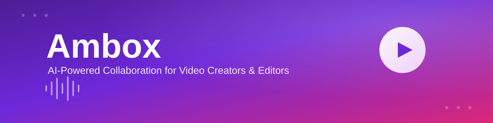
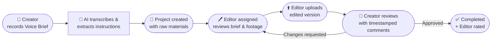
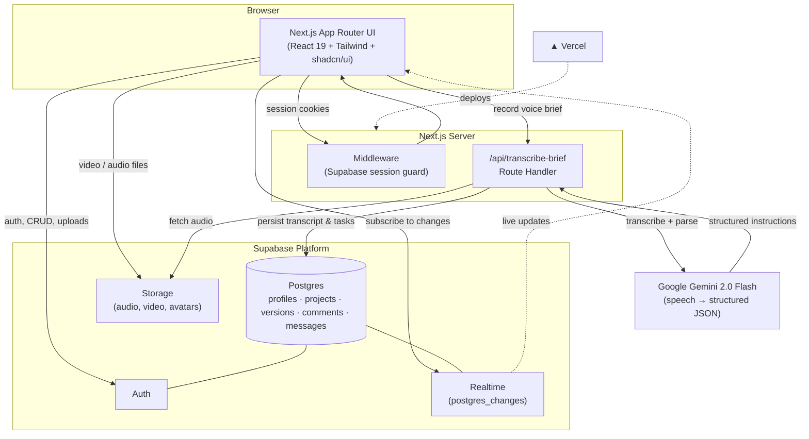
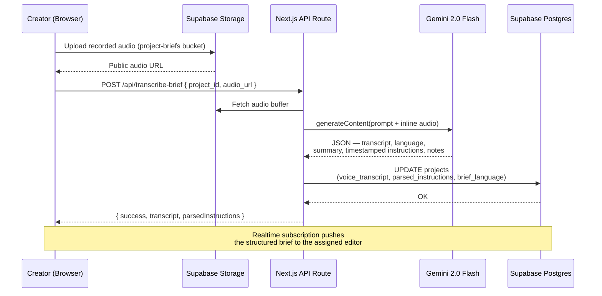
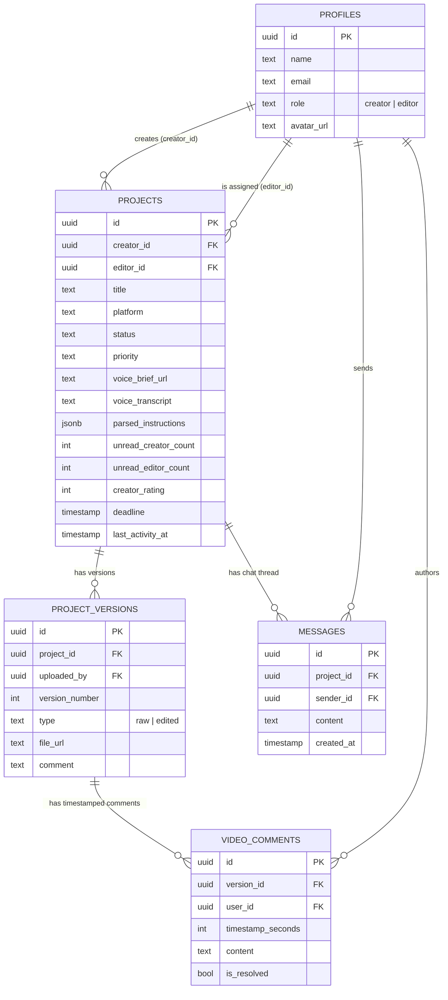
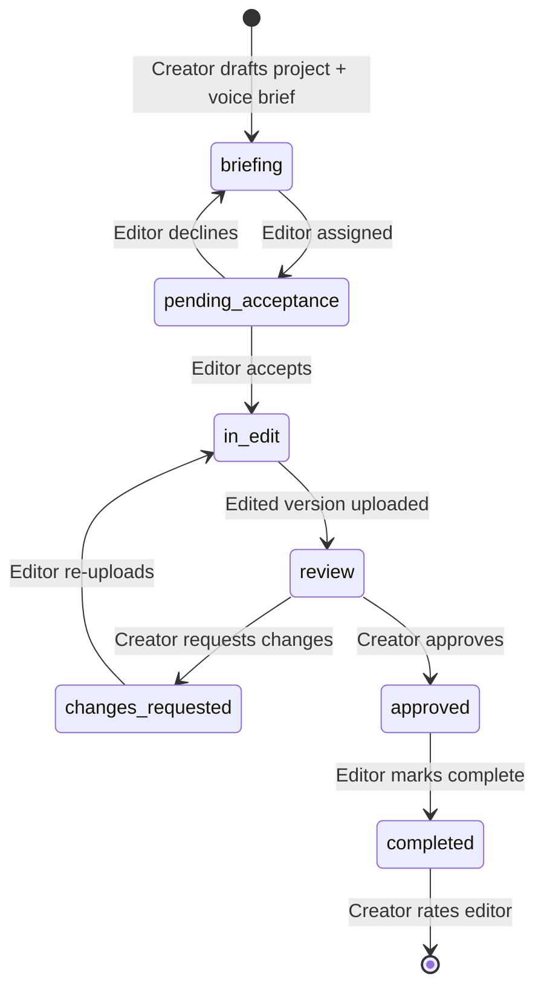

<div align="center">



<br/>

<h3>The command center for video creators and editors — briefs, revisions and approvals in one place.</h3>

[](https://ambox-t6yf.vercel.app/)
&nbsp;
[](https://nextjs.org/)
&nbsp;
[](https://supabase.com/)
&nbsp;
[](https://ai.google.dev/)

<p>
  
  
  
  
</p>

[Live Demo](https://ambox-t6yf.vercel.app/) · [Report a Bug](https://github.com/Mudavath-Giri-Naik/ambox/issues) · [Request a Feature](https://github.com/Mudavath-Giri-Naik/ambox/issues)

</div>

<br/>

## Table of Contents

- [Why Ambox](#why-ambox)
- [Features](#features)
- [How It Works](#how-it-works)
- [Architecture](#architecture)
- [AI Voice Brief Pipeline](#ai-voice-brief-pipeline)
- [Data Model](#data-model)
- [Project Lifecycle](#project-lifecycle)
- [Tech Stack](#tech-stack)
- [Project Structure](#project-structure)
- [Getting Started](#getting-started)
- [Environment Variables](#environment-variables)
- [Roadmap](#roadmap)
- [Contributing](#contributing)
- [License](#license)

<br/>

## Why Ambox

> Video production breaks down at the handoff between the person with the vision and the person with the timeline.

**The problem.** Creators and editors coordinate through a patchwork of tools that were never built for the job — Google Drive links for raw footage, WhatsApp voice notes for direction, email threads for approvals, and no single source of truth for *what version is the latest one*. Instructions get lost, feedback arrives out of context, and every revision round costs another day of back-and-forth.

| Without Ambox | With Ambox |
|---|---|
| Direction scattered across chats, notes, and calls | One AI-structured **Voice Brief** with timestamped instructions |
| "Which file is the final cut?" | Versioned uploads with a clear status per project |
| Feedback buried in message history | Timestamped comments pinned directly to the video |
| No visibility into where a project stands | A shared status pipeline both sides can see in real time |

**The solution.** Ambox is a single workspace that connects creators and editors around one project record. A creator records a spoken brief; Ambox transcribes it and extracts structured, timestamped editing instructions with AI. The editor works against organized raw materials and clear requirements, uploads versions for review, and the creator approves, requests changes, or rates the work — all inside one real-time thread.

<br/>

## Features

| | Feature | Description |
|---|---|---|
| 🎙️ | **AI Voice Briefs** | Creators record spoken instructions; Gemini transcribes the audio and extracts structured, timestamped, prioritized editing tasks — no manual note-taking. |
| 👥 | **Dual-Role Workspaces** | Purpose-built dashboards and flows for **Creators** and **Editors**, with role-aware navigation, stats, and actions. |
| 🔄 | **Project Lifecycle Tracking** | Every project moves through a clear status pipeline — briefing, assignment, editing, review, changes requested, approved, completed. |
| 🎞️ | **Version Control for Video** | Editors upload raw footage and successive edited cuts; creators can compare versions and always know which one is current. |
| 💬 | **Timestamped Video Comments** | Feedback is pinned to an exact point on the timeline instead of a vague written description. |
| ⚡ | **Real-Time Chat** | Project-level messaging with typing indicators and unread badges, powered by Supabase Realtime. |
| 🔔 | **Notifications & Activity Feed** | Live updates on assignments, status changes, and new messages so nothing falls through the cracks. |
| ⭐ | **Ratings & Reviews** | Creators rate editors on completion, building a track record that carries across future projects. |
| 🔐 | **Secure by Default** | Supabase Auth + middleware-enforced route protection keep creator and editor data isolated. |

<br/>

## How It Works



<br/>

## Architecture



<br/>

## AI Voice Brief Pipeline

The core differentiator of Ambox: a creator's spoken direction becomes structured, actionable, timestamped tasks in one round trip.



<br/>

## Data Model



<br/>

## Project Lifecycle

Every project moves through a well-defined status machine, driving what each role can see and do:



<br/>

## Tech Stack

<table>
<tr><td valign="top"><b>Framework</b></td><td>


</td></tr>
<tr><td valign="top"><b>UI &amp; Styling</b></td><td>


</td></tr>
<tr><td valign="top"><b>Backend &amp; Data</b></td><td>


</td></tr>
<tr><td valign="top"><b>AI</b></td><td>


</td></tr>
<tr><td valign="top"><b>Tooling &amp; Deployment</b></td><td>


</td></tr>
</table>

<br/>

## Project Structure

```text
ambox/
├── app/
│   ├── api/
│   │   └── transcribe-brief/     # Gemini voice-brief transcription endpoint
│   ├── auth/callback/            # Supabase OAuth/session callback
│   ├── components/               # App-level components (chat, modals, cards, feed)
│   ├── creator/dashboard/        # Creator workspace
│   ├── editor/dashboard/         # Editor workspace
│   ├── explore/                  # Discover creators / editors
│   ├── project/[id]/             # Project detail — brief, versions, chat, review
│   ├── login/ · onboarding/      # Auth & role onboarding
│   ├── notifications/ · search/ · settings/
│   └── layout.tsx · page.tsx     # Root layout & landing page
├── components/ui/                # shadcn/ui primitives (button, dialog, sidebar, ...)
├── hooks/                        # Shared React hooks
├── lib/
│   ├── supabase/helpers.js       # Typed data-access layer (projects, versions, comments, chat)
│   └── supabaseClient.js         # Browser Supabase client
├── middleware.js                 # Route-level auth guard
└── public/                       # Static assets
```

<br/>

## Getting Started

### Prerequisites

- Node.js 18+
- A [Supabase](https://supabase.com/) project (Auth, Postgres, Storage enabled)
- A [Google AI Studio](https://aistudio.google.com/) API key for Gemini

### Installation

```bash
git clone https://github.com/Mudavath-Giri-Naik/ambox.git
cd ambox
npm install
```

### Configure environment

Create a `.env.local` file in the project root — see [Environment Variables](#environment-variables) below.

### Set up Supabase

Follow [`SUPABASE_SETUP_CHECKLIST.md`](SUPABASE_SETUP_CHECKLIST.md) to provision the database schema, storage buckets, and Row Level Security policies. [`SUPABASE_DEPLOYMENT_GUIDE.md`](SUPABASE_DEPLOYMENT_GUIDE.md) covers the optional Edge Function alternative to the built-in API route.

### Run the dev server

```bash
npm run dev
```

Open [http://localhost:3000](http://localhost:3000).

<br/>

## Environment Variables

| Variable | Required | Description |
|---|---|---|
| `NEXT_PUBLIC_SUPABASE_URL` | ✅ | Your Supabase project URL |
| `NEXT_PUBLIC_SUPABASE_ANON_KEY` | ✅ | Supabase anonymous/public key (client-side) |
| `SUPABASE_SERVICE_ROLE_KEY` | ✅ | Service role key used by the transcription API route to write results server-side |
| `GEMINI_API_KEY` | ✅ | Google Gemini API key powering voice-brief transcription & parsing |

> Never commit `.env.local` — it's already covered by `.gitignore`.

<br/>

## Roadmap

- [ ] Email digest notifications for offline creators/editors
- [ ] Multi-editor collaboration on a single project
- [ ] In-app payments / escrow for project milestones
- [ ] Analytics dashboard (turnaround time, revision counts, ratings trends)
- [ ] Mobile-optimized recording & review experience
- [ ] Public editor portfolios

See [open issues](https://github.com/Mudavath-Giri-Naik/ambox/issues) for the full list of proposed features and known issues.

<br/>

## Contributing

Contributions make the open-source community a great place to learn and build. Any contributions are **greatly appreciated**.

1. Fork the project
2. Create your feature branch (`git checkout -b feature/amazing-feature`)
3. Commit your changes (`git commit -m 'Add some amazing feature'`)
4. Push to the branch (`git push origin feature/amazing-feature`)
5. Open a Pull Request

<br/>

## License

No open-source license has been declared for this project yet — all rights are reserved by the author unless a `LICENSE` file is added. Open an issue if you'd like to discuss licensing terms.

<br/>

<div align="center">

Built for the creator economy — one clear brief at a time.

[⬆ Back to top](#table-of-contents)

</div>
